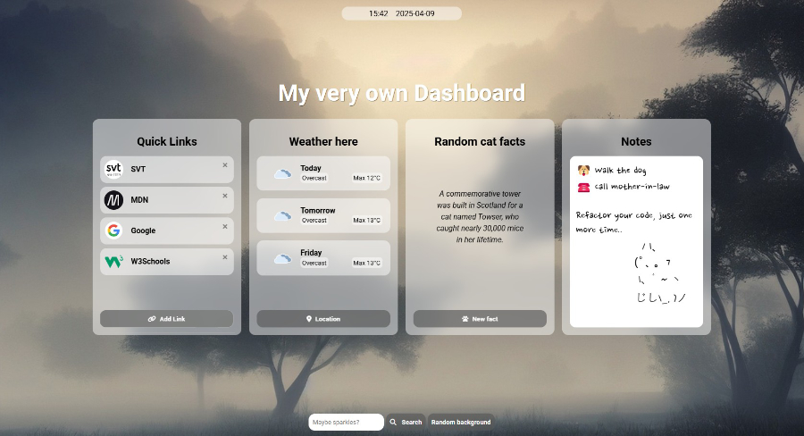

# Dashboard 

A modular dashboard with weather, links, notes and more! Built with JavaScript, using localStorage and external APIs.

[Live page!](https://linneatoth.github.io/dashboard/)

## General approach

**Modules** - Since this was bound to be more complex than anything we have built so far, with varied functionality and multiple data sources, I was set on implementing modules from the beginning. One advantage I find is that it is easier to break down the task into limited scopes. Another advantage is that it is so much easier to identify and remedy the inevitable errors and bugs, since the functionality is encapsulated.

**Classes and objects** - I have recently developed a taste for OOP, loading classes with whatever data and functionality I need for different areas. While some of the sections share some methods, I made a section class for them to inherit from.

**DRY** - The code might need another round or two in the tumbler, but I really strive to keep from repeating myself. It is oddly satisfying to reduce the code with recyclable methods and functions. However, I have discovered there is a fine line to tread. If everything is a criss-cross of dependencies and references, it compromises readability

**Async** - A lot of the code is asynchronous, permitting different parts to load without bottlenecking the app <em>(I'm Swedish, I get a non-native speaker's pass to mistreat the English language however I please - right?)</em>.

**Strict mode** - Opting out of "sloppy mode", primarily to avoid silent errors and get thrown errors instead.

**Modern native CSS** - In this project, I decided to go for modern CSS features, like using & for nested selectors.

## Time & Date

This module exports a simple function, that decides and sets the current time and date in existing elements.

**date.toLocaleDateString("sv-SE")** - Converter method used to format the date in a way that looks familiar to people from this part of the world.

**setTimeout** - Recursion is used to refresh the time in intervals of a second, to ensure real-time values.

## Section class

This provides a method that all of the inheriting classes can use:

**Build Element** - Takes type of element, text content, id or classes (all optional), and returns a DOM-element.

**Fetch Data** - Fetches data from an url, returning a JSON object.

## Quick Links

This class ensures that links can be added to and removed from the links section on the dashboard. Some of its functionality:

- Check local storage for stored links
- Adding new links, if it doesn't break the limit of five
- Delete links
- Function that returns a "card" for each link
- DOM building function, that creates all elements and puts them together on the page. It adds event listeners where needed.

## Weather

The weather section provides a forecast for three days, with data from open-meteo. It can either use the browser's geolocation and show the weather for the users current location, or take another city and show the forecast for that place. Some of the functionality provided by the class:

- Getting the current position by the browser's geolocation
- Fetching weather data and returning it as a JSON-object
- Create elements, eventlisteners and containers for populating the DOM
- Search function to change location

## Random Facts

This section provides random cat facts from https://catfact.ninja/. The functionality of the class is pretty straight-forward. It uses the inherited fetchData-method to get a new random fact. Upon a click on the button, the random fact on display is replaced with a fresh one.

## Notes

On every registered input, local storage is updated with whatever the notepad says. Stored notes are reloaded into the textarea when the page is launched.

## Background

The dashboard provides two different options of changing the background:

- Search
- Random

When the instance is initialized, it will get the current window dimensions and instantly set a random background from Pixum.

To avoid hard coding my personal Pixabay API-key, I have made a solution that prompts the user for a key and stores it in localStorage (if it proves to be valid).

## Customizable heading

This tiny class ensures that the heading can be changed. I wanted to use an HTML-element that is made for taking input. The element I chose is a textarea, to facilitate for more rows on smaller devices. There is a matchMedia method in use, specifying the breakpoint where more rows are needed.

The script listens for changes to the textarea value, and stores the content to localStorage. Upon load, it will make sure the stored text is displayed in the textarea.

## Conclusion

### Strengths:
- Separation of concerns and modularity. I have divided the code into separate classes, based on functionality. It makes for easier troubleshooting and smoother development.   

- Since we are currently working with front-end technologies in my education, I don't have access to optimal methods of securely dealing with API keys. Hardcoding them make them easily available. If I use Github's tools for keys they are somewhat hidden, but would still be visible through the browser when using the dashboard. Therefore, I came up with a workaround, that prompts the user for their key and stores it locally in localStorage.
While it isn't perfect, at least the key is not going to be distributed in clear writing. I debated whether to list this as a strength or marking it with room for improvement. My opinion is ultimately that this is a strength, since it solves the problem with the tools and means accessible at the moment.

### Room for improvement:

- The heading in the weather section depends on whatever input the user gives when searching. This might, in some situations, not be optimal. If I were to give this a rework, I would base it on the chosen search result.

- Even though CSS nesting is a baseline feature since 2023, and should be available to most users, there will be some older browsers it doesn't yet work on. According to caniuse.com, approximately 8.6% of users, globally, will have issues with displaying my dashboard as intended.

## The full details of the assignment are provided below - machine translated from Swedish, for your convenience!

> ### About the Task
>
> In this task, you are going to build a personal dashboard that the user can use as the start page in their browser. This dashboard will have parts that the user can customize as well as information retrieved from APIs.
> What You Should Do
> Overall Requirements
>
> [ ] The task should be built using HTML, CSS, and JavaScript, and you cannot use pre-made frameworks.
>
> [ ] The dashboard should store information in LocalStorage so that the changes persist when the dashboard is reopened.
>
> [ ] The design does not need to follow the mockup provided exactly, but try to replicate it to practice CSS.
>
> [ ] You should package your app for delivery (Deploy). Delivery or deployment is not necessary, though. </aside>
>
> Functionality
>
> There are a total of seven (7) sections in the dashboard that need to be built. These are marked in the image below.
>
> Functionality Description:
>
> This section should display the current time and date, and the clock should update in real-time without reloading the page.
>
> The user should be able to edit the title of the page by clicking on it. Once clicked, the title becomes editable, and changes are saved immediately.
>
> This section contains links saved by the user. The user can delete links (3a) and add new ones (3b). When adding new links, the user should provide the URL and a label that will be displayed on the dashboard.
>
> Extra Challenge: Fetch the link's favicon and display it as an image in the dashboard.
>
> This section should display the weather forecast. It doesn't need to look exactly like the sketch, but the data should come from an open API. To determine the city for which the weather is displayed, the browser's geolocation API should be used.
>
> Extra Challenge: Allow the user to customize the location displayed.
>
> This section is entirely up to you to design. However, it must include data from an external API. For example, it could show the latest news or stock prices.
>
> In this section, the user should be able to write quick notes. Think of a large textarea where everything typed is saved continuously. There shouldn't be multiple notes, just a single note-taking space.
>
> Extra Challenge: Allow the user to enter a keyword, which will be used to fetch a randomized image within the desired theme.
>
> VG-Level Question
>
> You only need to complete this part if you're aiming for a VG (Very >Good) grade.
>
> When the user clicks this button, a random image from the Unsplash API should be fetched and set as the background of the dashboard.
>
> In your README file on GitHub, you should include a discussion about your code. In this, you should evaluate the strengths and weaknesses of your implementation—that is, the code you developed.
>
> VG-level evaluation is based on the quality of the code combined with your ability to identify its strengths and weaknesses. This means that if the code quality is too low, simply discussing it won’t save your grade. However, it also means that the code doesn’t have to be perfect, as long as you can point out the flaws you see.
